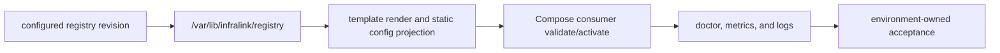
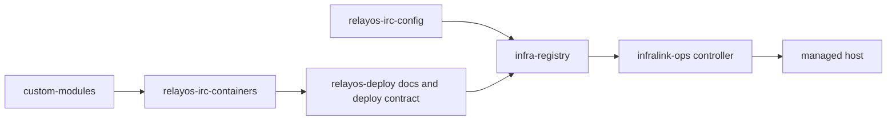

# Infralink Ops

## BLUF

This repo packages the public controller runtime for managed hosts. Deployment
intent, private templates, and secret aliases remain in the environment
registry; live-service acceptance remains environment-owned operational state.

Use it when you need bounded host primitives for registry checkout, template
rendering, config projection, Docker image retention, Compose consumer
activation, firewall verification, secret rendering, or host doctor evidence.

Do not use this repo to select fleet desired state. Registry revisions, service
definitions, image pins, hostnames, and secret bindings come from the
environment registry.

## Reader Paths

| Goal | Start here |
| --- | --- |
| Understand the runtime boundary | [Controller runtime guide](docs/controller-runtime-guide.md) |
| Safely inspect an installed host controller | [Installed CLI quickstart](docs/installed-cli-quickstart.md) |
| Promote, verify, or roll back a Registry change | [Registry rollout runbook](docs/registry-rollout-runbook.md) |
| Diagnose stale controller or host evidence | [Stale-host triage runbook](docs/stale-host-triage.md) |
| Identify the right controller command and its authority | [Controller CLI reference](docs/controller-cli-reference.md) |
| Debug a stale RelayOS staging rollout | [Controller runtime guide](docs/controller-runtime-guide.md#triage-a-stale-host) |
| Check available CLIs | [`pyproject.toml`](pyproject.toml) |
| Inspect host-installed launcher assets | [`src/infralink_ops/assets/`](src/infralink_ops/assets/) |
| Review controller behavior | [`src/infralink_ops/`](src/infralink_ops/) and [`tests/`](tests/) |

## How It Fits



This repo implements the bounded primitives in the middle of the flow. It does
not own the registry data model or the environment-specific acceptance result.

## Main CLIs

| Command | Purpose |
| --- | --- |
| Controller-owned Registry checkout | Fetch the declared Registry ref into the sole configured checkout. |
| Controller-owned template rendering | Render registry-declared templates from explicit inputs. |
| Controller-internal config-consumer activation | Validate or recreate services affected by rendered config changes. |
| Controller-owned secret rendering | Resolve registry-declared render-secret bindings through BWS. |
| Controller-owned firewall stage | Render or verify declared nftables policy. |
| `infralink controller doctor` | Read-only host-runtime check for registry, reconcile, Compose, firewall, and metrics evidence. |
| `infralink-host doctor\|reconcile\|bootstrap --apply` | Host launcher installed from [`src/infralink_ops/assets/infralink-host`](src/infralink_ops/assets/infralink-host). |

Each command is intentionally narrow. Commands receive explicit inputs and
return bounded machine-readable envelopes where possible.

## Authority Boundary

| This repo owns | This repo does not own |
| --- | --- |
| Controller image build recipe. | Which registry revision a host should run. |
| Host launcher and systemd unit assets. | Service definitions, hostnames, DNS, certificates, or image pins. |
| Runtime primitives with bounded inputs and outputs. | Tenant or application policy. |
| Doctor and evidence helpers. | Live-service acceptance criteria. |
| BWS resolution primitive. | BWS secret values or registry secret declarations. |

For RelayOS IRC, source/config/image repos feed the registry first:



## GHCR and BWS

The controller image publishes to
[cyberstorm-dev packages](https://github.com/orgs/cyberstorm-dev/packages) as
`ghcr.io/cyberstorm-dev/infralink-ops-controller`.

BWS access is runtime-only. This repo contains the resolver and tests for the
resolver contract; the token and secret object names belong to the environment
registry and host runtime.

## Verify Changes

Run the same checks Woodpecker runs:

```bash
python -m pip install --disable-pip-version-check \
  'infralink>=0.6.22,<0.7'
python -m pip install --disable-pip-version-check -e '.[dev]'
python -m ruff check src tests
python -m ruff format --check src tests
python -m pytest -q
python -m build
```

Infralink Ops declares compatibility with Infralink `>=0.6,<0.7`. Until
Infralink is published to PyPI, bootstrap a released, checksum-pinned wheel
before installing Ops so a clean environment does not attempt an unavailable
index resolution.

The controller image publish step runs only on `main` pushes. Pull requests use
Docker buildx dry-run validation.

## Triage A Stale Host

Check in this order:

1. Confirm the environment selected the intended registry revision.
2. Confirm `/var/lib/infralink/registry` has the expected checkout.
3. Run `infralink-host doctor` for read-only host evidence.
4. Inspect `/var/lib/infralink/reconcile-result.yml` as the last reconcile
   result, not as desired state.
5. Check whether `infralink-host-reconcile.timer` ran after the registry change.
6. Check rendered files under `/opt/services/config`.
7. Check the affected Compose service or application-specific behavior.

Do not repair desired-state drift by editing `/opt/services` directly. Fix the
registry or source repo that owns the value, then let the controller reconcile.

## Development Contract

- Keep commands agent-friendly: explicit inputs, bounded output, stable exit
  behavior, and machine-readable evidence.
- Keep provider-specific policy out of generic primitives unless the command
  name says it is provider-specific.
- Add tests for every command contract, runtime boundary, and failure mode.
- Keep README-level docs focused on operator entrypoints; put command-specific
  details in focused guides or tests.
