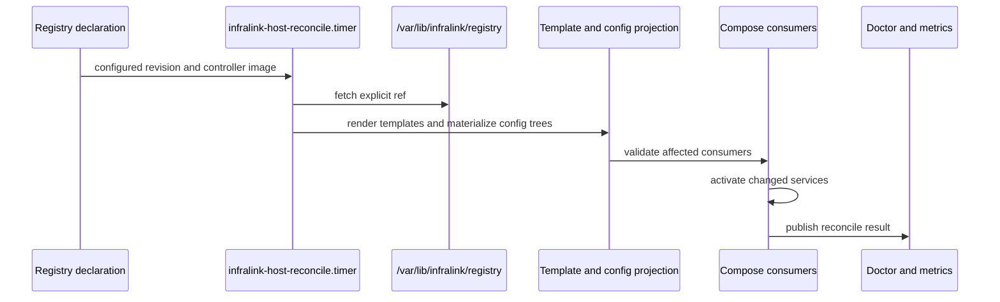

# Infralink Ops controller runtime guide

## BLUF

Use this guide to understand what the host controller can do and what
evidence it can produce.

The controller applies a registry revision that another layer selected. It does
not choose tenant config, image digests, secrets, DNS, or service policy.

## Runtime Lifecycle

## Controller Primitives

| Primitive | Command | Evidence |
| --- | --- | --- |
| Registry checkout | Controller-owned Registry checkout | Detached registry revision. |
| Template rendering | `infralink-controller-template-render` | Rendered files from explicit inputs. |
| Static config trees | `materialize_config_tree` | Changed paths below the declared target. |
| Compose consumers | Controller-internal config-consumer activation | Affected consumers and services. |
| Secrets | `infralink-controller-render-secrets` | BWS-backed rendered values without committing secrets. |
| Firewall | `infralink-controller-firewall render\|verify` | Declared nftables table or runtime drift result. |
| Doctor | `infralink-controller-doctor` | Read-only host consistency envelope. |

## BWS Contract

The controller can resolve registry-declared BWS bindings at runtime. It must
not commit secret values, print tokens, or infer undeclared secret names.

Failure to resolve BWS is a registry/runtime failure. Do not fix it by hardcoding
a value into source, rendered config, or a Compose file.

## GHCR Contract

Woodpecker publishes the controller image to
[cyberstorm-dev packages](https://github.com/orgs/cyberstorm-dev/packages) as
`ghcr.io/cyberstorm-dev/infralink-ops-controller` on `main` pushes.

Use immutable `sha-<short-sha>` tags or digests for evidence. Do not use `head` or `main` as acceptance evidence.

## Triage A Stale Host

1. Confirm the registry revision that the environment intended to run.
2. Confirm `/var/lib/infralink/registry` resolved to that revision.
3. Run `infralink-host doctor`.
4. Check `systemctl status infralink-host-reconcile.timer`.
5. Inspect `/var/lib/infralink/reconcile-result.yml` for the last reconcile
   evidence.
6. Inspect rendered files under `/opt/services/config`.
7. Check the live service using environment-owned acceptance criteria.

If evidence points to a wrong source value, fix the owning source repository or
registry declaration. If evidence points to controller behavior, fix this repo
with tests and publish a new controller image.
